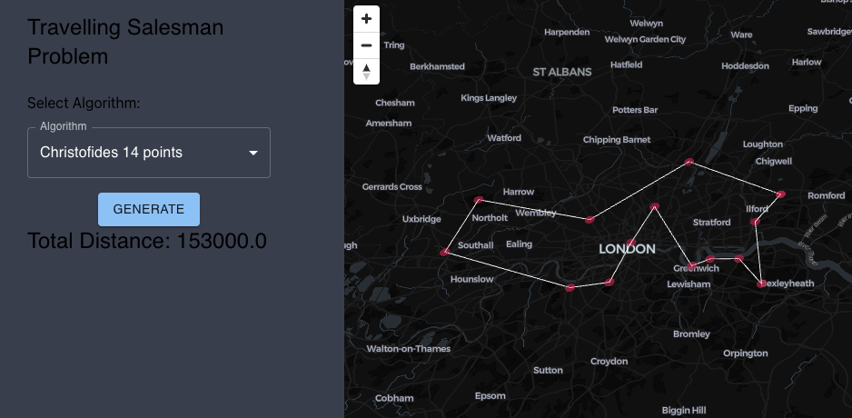
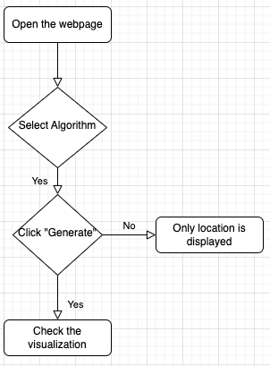

# INFO6205_Traveling_Salesman
INFO6205 Project: The Traveling Salesman Problem

## Group Information:
### Project Members: 
1. Akshay Parab (NEUID: 002766150, Section: 3) 
2. Kaushik Gnanasekar (NEUID: 002766012, Section: 3) 
3. Shivam Thabe (NEUID: 002765286, Section: 3) 


## Running the webpage:

### Steps:
1. Clone the app with the command: git clone git@github.com:shivamt24/INFO6205_Traveling_Salesman.git
    ```
    git clone git@github.com:shivamt24/INFO6205_Traveling_Salesman.git
    ```
2. Open the app on the terminal
3. Move to the folder visualize/tsp-vis “command : cd visualize/tsp-vis”
    ```
    cd visualize/tsp-vis
    ```
5. Install the react dependencies “command: npm i”
    ```
    npm i
    ```
6. Run the app “command: npm start”
    ```
    npm start
    ```
7. The app will be hosted on http://localhost:3000/

### Additional Steps to generate custom output and visualize:
1. Run the Java algorithm as per the java documentation.
2. The output csv files will be generated, copy these files to the location “visualize/tsp-vis/src/csv”
3. Note: The copied files must be renamed to either “christofides.csv” or “annealing.csv”
4. Run the command: “npm start” after moving inside the react project


## Visualization:
### User Interface Flow chart



## To use the travelling salesman Java algorithm with the provided dataset, follow these steps:

### Steps:
1. Click on the "Select Algorithm" drop down and select the desired algorithm to display.
2. Once the algorithm is selected, the locations will be plotted on a map based on the input CSV data.
3. Click on the "Generate" button to display the paths connecting the locations according to the output generated by the selected algorithm.
